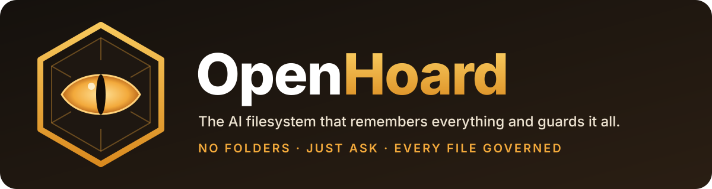

<p align="center">
  
</p>

<p align="center">
  <a href="LICENSE"></a>
  
  
  
  
</p>

<h1 align="center">Folders are dead. Long live the Hoard.</h1>

<p align="center">
  <b>The first open-source AI filesystem.</b><br>
  Stop filing. Stop searching. Stop wondering who can see what.<br>
  <i>Just ask, and the dragon brings it back.</i>
</p>

---

> **"Open the Acme Q3 deck."** · **"What CSVs was I working on yesterday?"** ·
> **"Share the forecast with Acme, read-only, until Oct 31."** · **"Who can see payroll, and why?"**

OpenHoard replaces the folder tree with an AI-managed, **governed** file layer. Every file is
indexed, tagged, summarized and access-controlled, so people and their AI agents find
things by *meaning*, not by path. Every action is checked by policy and written to a
tamper-evident audit log.

> **Status: pre-alpha, designed in the open.** The vision below is where we're headed; see
> the [roadmap](docs/roadmap.md) for what exists today.

## The headlines

| | |
| --- | --- |
| 🐉 **Your files, finally findable** | Ask in plain English. Permission-aware search across SharePoint, cloud buckets and Git, with zero AI tokens spent per search. |
| 🔒 **Every file has a guardian** | Access follows tags, not folders. Former employees lose access automatically. External links expire by default. |
| 🧠 **The filesystem that remembers** | "What was I working on yesterday?" "What changed in the Acme contract?" OpenHoard keeps the history, so you don't have to. |
| 🏷️ **No more `Final_v2_FINAL.docx`** | AI names, tags, deduplicates and spots the real final version, and warns you before you send an old one. |
| 🤖 **Bring any AI. Keep control.** | Works with Claude, ChatGPT, Copilot or local models over MCP. You decide, per tag, what AI is allowed to read. |
| 🛡️ **Built for auditors, not just users** | Hash-chained audit log, 30-day undo on everything, HIPAA / SOC 2 / legal-hold packs on the roadmap. |
| 📦 **No migration required** | Index SharePoint and OneDrive in place today. Move shared work into S3 or Azure Blob when you're ready. |
| 🚚 **SFTP is over** | Send customers a link. They drag in 1 GB+ files from any browser, with no account and no client, and the files land tagged in the right project. |
| 🧩 **Open core, open edges** | Apache-2.0. Connectors, enrichers, policy packs and skills are plugins anyone can build. |

## Why your company needs this (the slide for your boss)

The folder tree was designed for filing cabinets. It's failing modern teams:

- **54%** of US office workers say they waste time searching for files in disorganized systems ([Elastic / Wakefield Research via TechRepublic](https://www.techrepublic.com/article/more-than-50-of-office-pros-spend-more-time-searching-for-files-than-on-work/)).
- **77%** of organizations had at least one Microsoft 365 governance incident in the past year ([ShareGate survey via WindowsForum](https://windowsforum.com/news/microsoft-365-copilot-38-report-stale-access-in-sharegate-survey.445625/)).
- **38%** had former employees or guests keep access they should have lost, and **26%** had sensitive content reach the wrong people (same survey).
- AI assistants now read everything a user can access, so **oversharing that used to be hidden is now one prompt away.**

**OpenHoard's pitch in one line:** *keep your storage, lose the chaos*. Findable files,
provable access control, and AI you can actually trust with company data.

<details>
<summary><b>For IT: the 60-second version</b></summary>

- **Deploys like any managed app:** SSO (Entra ID, Google, Okta), SCIM, silent sign-in, MDM packages (planned).
- **Least privilege by design:** SharePoint access via `Sites.Selected`; AI clients on an allowlist; plugins sandboxed with declared capabilities.
- **One policy layer** across SharePoint, buckets and Git, readable as "who can see this and why".
- **Security-first AI:** prompt injection is in the threat model from day one. Text in a file can never authorize an action.
- **No lock-in:** open source, self-hostable, one-click export of files, tags and audit history.

</details>

## How it works

```
            ┌──────────────── Trusted core (small, audited) ────────────────┐
            │ identity · permissions/policy · index/search · summaries ·    │
            │ audit · plugin sandbox                                        │
            └───────────────────────────────▲───────────────────────────────┘
                                            │ versioned contracts + capability manifests
   connectors · enrichers · policy/vocabulary packs · skills · client integrations
```

The core makes every trust decision. Plugins extend what OpenHoard can **reach** and
**understand**; they can never decide who gets access. Deep dives:
[architecture](docs/architecture.md) · [threat model](docs/threat-model.md) · [roadmap](docs/roadmap.md).

## Repository layout

| Path | What lives there |
| --- | --- |
| `core/` | The trusted core: `identity`, `policy`, `catalog` (index + search), `summarize`, `audit`, `sandbox` |
| `connectors/` | Storage and source connectors (S3, Azure Blob, SharePoint, Git hosts, …) |
| `enrichers/` | Extractors and taggers for specific file types |
| `packs/` | Policy and tag-vocabulary packs (legal, healthcare, manufacturing, …) |
| `skills/` | Agent skills built on the core MCP tools |
| `clients/` | Web app, desktop client, Office/Teams integrations |
| `schemas/` | Versioned JSON Schemas for plugin manifests and other contracts |
| `packages/cli-js`, `packages/cli-py` | The `openhoard` CLI (npm and PyPI) |
| `assets/` | Logo and brand assets |

## Try the CLI

Today the CLI validates plugin manifests against the published schema, the first contract every plugin must meet.

```bash
npx openhoard manifest validate connectors/example/openhoard.plugin.json
pipx run openhoard manifest validate connectors/example/openhoard.plugin.json
```

## Join the hoard

We're building this in the open and want the community to own the edges.
Start with [CONTRIBUTING.md](CONTRIBUTING.md). Connectors, enrichers, packs and skills
are the best places to begin. Found a security issue? See [SECURITY.md](SECURITY.md).

## License

[Apache-2.0](LICENSE) · "OpenHoard" and the dragon-eye logo are trademarks of the OpenHoard project.
