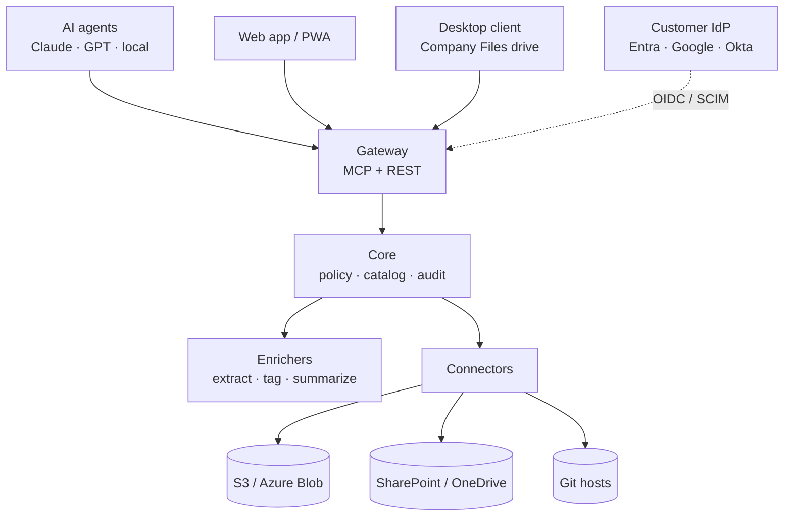

# Architecture (overview)

OpenHoard has a deterministic **control plane** (identity, policy, index, audit, storage
adapters) and an **AI plane** (ingest enrichment plus whatever agent the user brings, over
MCP). Every read, write, share and move passes the policy engine and lands in the audit
log. AI never makes access decisions.

## Core pillars

| Pillar | Owns | Never delegated to plugins |
| --- | --- | --- |
| Identity | Users, groups, sessions, AI-client allowlist | Issuing tokens, trust labels |
| Permissions + policy | Grants, visibility, exposure, evaluation | Allow/deny decisions |
| Catalog (index + search) | Objects, versions, tags, access-filtered hybrid search | Access filtering, result trimming |
| Summarize | File-card schema, summary pipeline, model routing by exposure | Which model sees which content |
| Audit | Hash-chained event log, export, undo | Writing or altering events |
| Sandbox | Manifests, capabilities, isolation, signing | Granting extra capabilities |

## Key concepts

- **Object → Version → Blob.** A file is an object; each version points to an immutable,
  content-addressed blob (dedupe for free).
- **Tags** come from an approved vocabulary of facets (`project`, `client`, `type`,
  `status`, `sensitivity`, `owner`). Access is granted mostly to tags, not files.
- **Visibility** per tag: `hidden`, `discoverable` (title + request access), `readable`.
- **Exposure** per tag: `full`, `commercial-only`, `local-only`, `metadata-only`, which controls
  what AI clients and plugins may receive.
- **Zones:** Managed (bucket), Indexed (in place, e.g. SharePoint), Local-only, Code (Git).

## Permission-aware search

One index per tenant; each query is filtered to the caller's principal set **inside** the
query (keyword and vector), before ranking or counting. Top hits are re-checked by the
policy engine. Counts, facets, autocomplete and summaries are computed only over what the
caller may see.

v1 engine: Postgres + ParadeDB `pg_search` + pgvector. Scale-out option: Meilisearch.

## Extension points

| Type | Interface (v1) | Runs in |
| --- | --- | --- |
| Connector | `crawl`, `delta`, `read`, `write`, `acl_import`, `redirect` | Sandbox with a network allowlist |
| Enricher | `accepts` → `extract` → `propose_tags`, `fields`, `summary_hints` | WASM or container; no network by default |
| Pack | Declarative facets, values, defaults, Cedar policies + tests | Data only |
| Skill | SKILL.md using core MCP tools | The user's agent, with the user's permissions |
| Client | Gateway REST/MCP + webhooks | Outside the core, allowlisted OAuth client |

Manifest schema: [`schemas/plugin-manifest.v1.schema.json`](../schemas/plugin-manifest.v1.schema.json).

## MCP tools (planned)

`find`, `recent`, `describe`, `open`, `ingest`, `tag`, `share`, `revoke`,
`access_review`, `audit`, `subscribe`, `repo_context`. Reads return compact file cards;
writes require a user confirmation issued by an OpenHoard client.

## Proposed stack

TypeScript gateway + MCP server · Python enrichment workers · Postgres 16 + pgvector ·
S3 by default, Azure Blob supported (via a storage abstraction such as Apache OpenDAL) ·
Cedar or OpenFGA for policy · Next.js web app · Tauri desktop shell.
